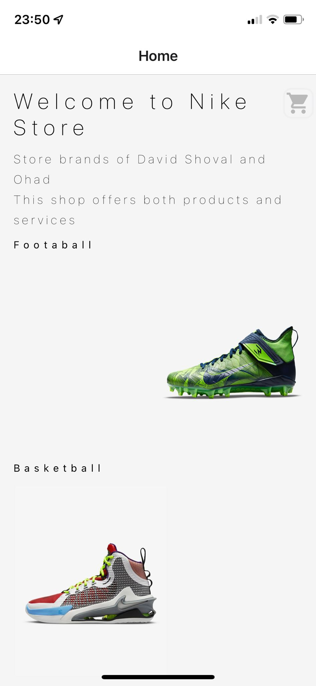
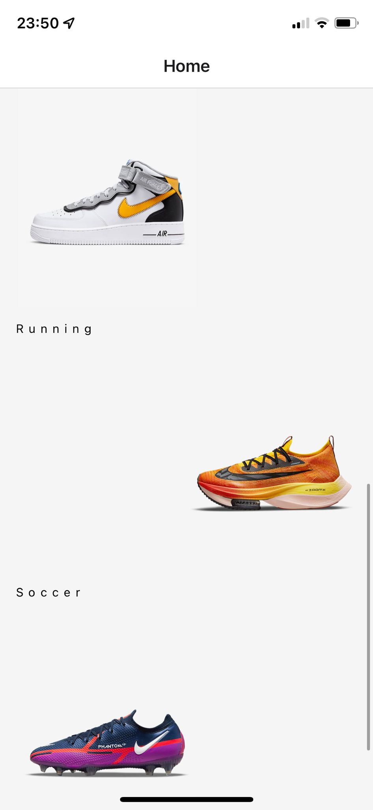
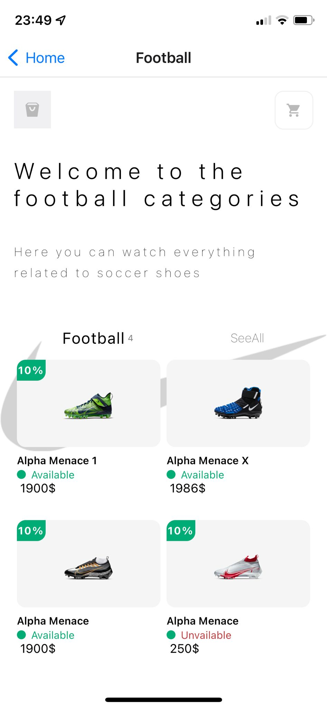
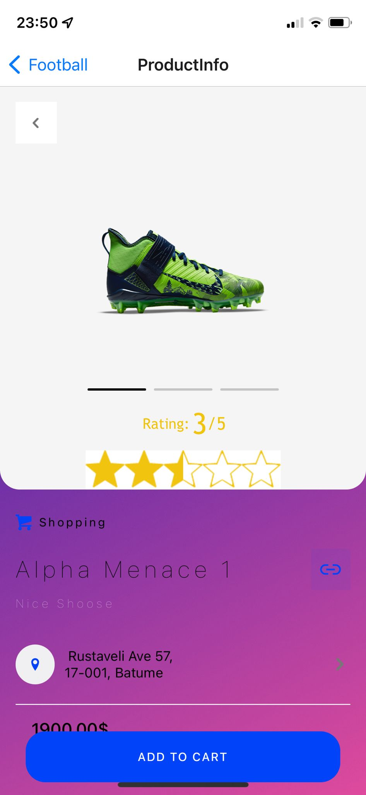
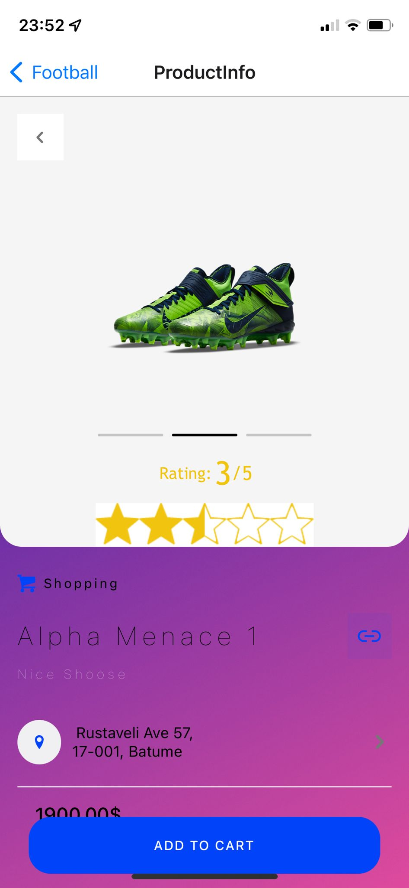
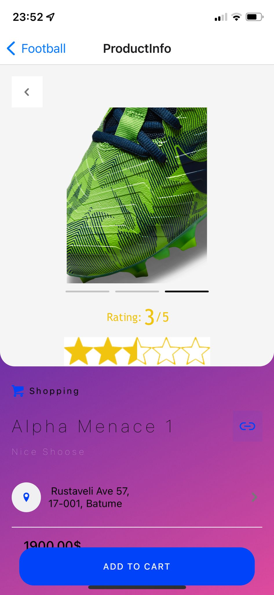
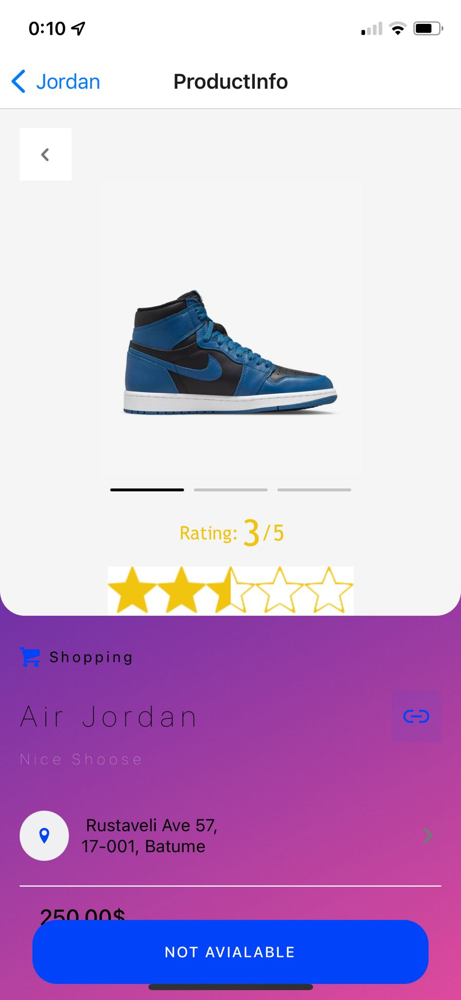
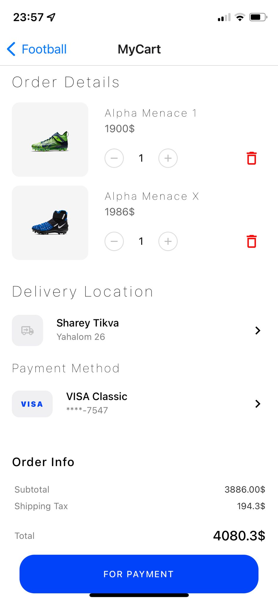
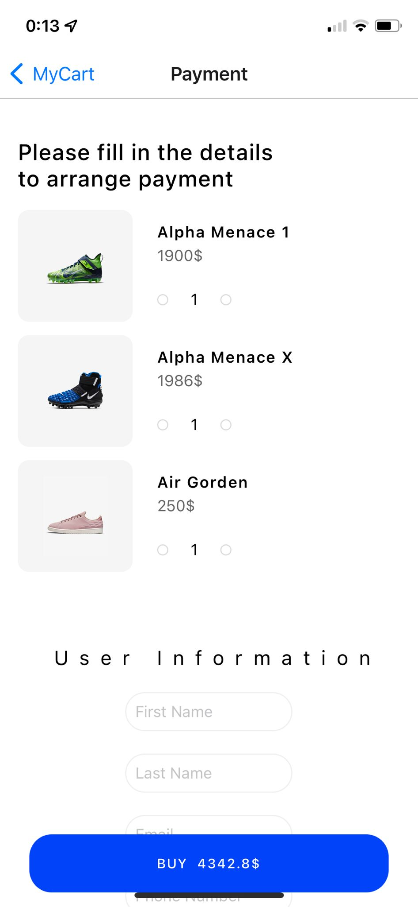
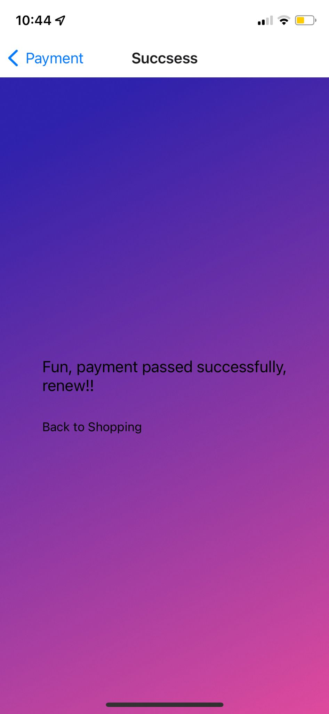

# React-native-app-store

#### Video 

https://user-images.githubusercontent.com/92857359/154974262-a5d97b95-4da1-47a9-9a65-d6362dc53d82.mp4

##### Nike Shoes store App

##### Final project in React-native course.

##### This Application offers both online shop and service for all Nike shoes category.

##### Develop by me and my friends as a final project. 

##### All rights reserved – Ohad Cohen, David Shoshan and Shoval Soli.

##### Visibility on app screens here :   
# Home Screen 

##### On this page we can see all the optional shoes for online order. 

##### There is any kind of Nike shoes.
##### * In any category of shoe, you will navigate to the specific category by clicking
 ##### and add it to the cart if you like to buy.
##### * There is cart icon in the header of the app, by click on it you will navigate to the shopping cart in our app.
##### * On the left side in the header we have a bucket icon to delete the product that you don’t want any more .

---------------------------------------------------------
# Category Screen 

##### In Category page we have
##### All products that are accessible for purchase. 

###### There is a cart icon in the header that navigate us to the shopping cart screen. 

##### We can see also if there is any special sale's during the week,
##### Or any new sales for the future.

---------------------------------------------------------
# Product Details Screen 

##### •	We can see if the product is readily available OR NOT

##### •	Product price (with or without discount)

##### •	Product description

##### •	shoe size

##### 	You can see if the product is available to ship to your address

##### •	Customer reviews

##### •	Product picture on 360°

---------------------------------------------------------
# Cart Screen 

##### On this page we have a list with all the products we add to the cart,
##### We Also develop a special Method for using a coupon from the users.

##### •	List with all the product we want to order

##### •	You can use your coupon (only if you have one)

##### •	Final price for all the products + delivery + Discount if you have a coupon

##### •	Delivery Location

##### •	Details of the last order payment

##### •	Last Price after sale including shipping

##### By clicking the button, you will move to the payment screen 

---------------------------------------------------------
# Payment Screen 

 

##### On this screen we can see all the product details and the payment details before we pay.

##### •	User Information (Full name, Email, Phone-number, Country, City, Zip Code, Address ).

##### •	Payment Details (Owner Card details, ID Number, Credit Card Number, CVV, Card validity).

##### •	We did a Validation testing , witch means that if DO NOT give the correct details you cannot  access to the next page .

---------------------------------------------------------
# Order accepted Screen 

##### On this page we can see if our payment passed successfully OR not

##### •	A button that leads to further shopping on the Application 
